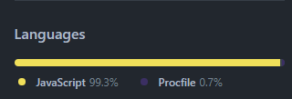

# Welcome to DQ-API

#### For documentation on using the routes visit [Documentation](https://dequeserver.herokuapp.com/api-docs/)

#### This project is made in Node and Express

#### For cloning this project
##### - Download the ZIP file of the project and extract it
##### - Run ```npm install``` on the terminal
##### - Check on the ```localhost:5000``` of your browser

#### Language used



#### URL of the project
```https://dequeserver.herokuapp.com```

#### In case of any queries, contact:
[Steve Rogers ;)](https://github.com/shashank-taliwal)
