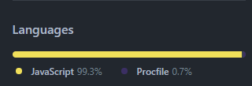

# Dqueue-App By Team SHIELD 
Dqueue-App is a web app based on MERN stack which intends to solve the issue of longer waiting queues at the billing counters in shopping malls.

## Problem Statement:

### Slow billing process due to limited payment counters compared to customers' queue.

## Solution Proposed as:-

#### -> Customers can scan the barcode on their own and make payment
#### -> Traffic on Billing counter will be minimised.
#### -> Customers are the now "The Checkout Counters"
#### -> Based on the DIY approach
#### -> Payment gateway integrated with mobile application for seamless one-place-for-all experience.
#### -> Reducing the time consumption by ~59%

### So starting with the Use cases here are links followed by the deployed Web-app
## [Live- demo](https://d-queue.herokuapp.com/)
## [Presentation](https://drive.google.com/file/d/184Pq3uG9BEBGNsGoP0SkSW82reiL4CSm/view)
## [Introductory video- Phase-1](https://www.youtube.com/watch?v=de2SLObCJwU)
## [Prototyping on Figma](https://www.figma.com/file/iODgMuckYLtuDI2fbMPcmy/Bar-Code-Scan-App-(Community)?node-id=0%3A1)


# Backend

## Welcome to DQ-API

#### For documentation on using the routes visit [Documentation](https://dequeserver.herokuapp.com/api-docs/)

#### This project is made in Node and Express

#### For cloning this project
##### - Download the ZIP file of the project and extract it
##### - Run ```npm install``` on the terminal
##### - Check on the ```localhost:5000``` of your browser

#### Language used



#### URL of the Server of project
```https://dequeserver.herokuapp.com```

# In case of any queries, contact:

[Steve Rogers ;)](https://github.com/shashank-taliwal)

[Agraj Agrawal](https://github.com/agrajagrawal)

[Vaibhav Shukla](https://github.com/raxvab)

[Priyanshu Rathore](https://github.com/priyanshu-r19)

[Rupesh Nandan Yadav](https://github.com/rnyadav3)

